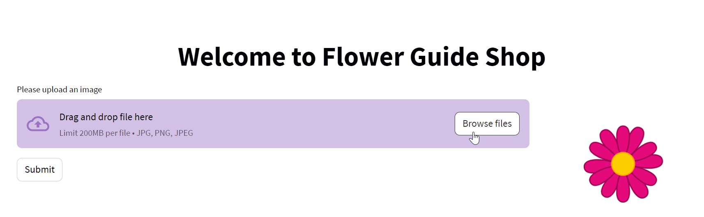
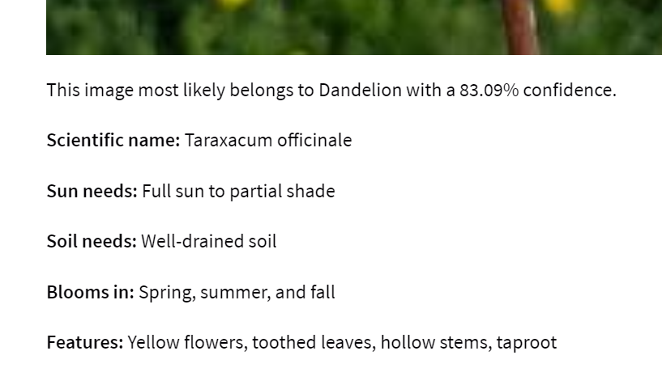

# Flower Guide Shop

The Flower Guide Shop is an interactive web application that utilizes a Convolutional Neural Network (CNN) model to classify flower images and provides detailed information about the flowers. The app allows users to upload an image of a flower, and based on the trained CNN model, it predicts the flower type and provides a comprehensive flower guide.

## Features
**Flower Classification:** Upload an image of a flower, and the app uses a CNN model to predict the flower type from the following classes: Daisy, Dandelion, Rose, Sunflower, and Tulip.

**Detailed Flower Guide:** Once the flower type is predicted, the app displays a detailed flower guide, including the scientific name, sun needs, soil needs, blooming season, and other interesting features of the flower.

## How the app works
Here are some example images demonstrating the working of the Flower Guide Shop app:

**1. Upload the Flower Image:**

Upload a flower image and click submit

**2. Flower Classification:**

The app predicts the uploaded flower image as a "Dandelion".

**3. Flower Guide:**

Along with prediction shows some features to specific features.

## Conclusion
The Flower Guide Shop app provides an intuitive way to classify and explore different types of flowers. It combines the power of a trained CNN model for accurate flower classification and the OpenAI API to generate detailed flower guides. With its user-friendly interface and informative content, the app is a valuable resource for flower enthusiasts and those interested in learning more about various flowers.